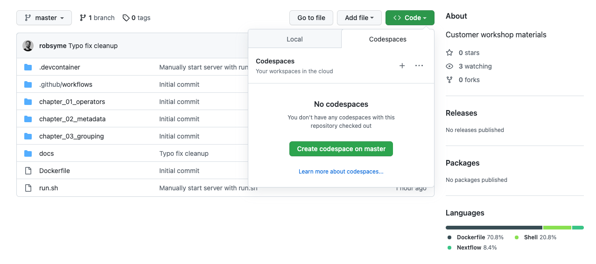

# Seqera Customer Training Workshop

This repository contains materials for the Seqera customer training workshop.

To participate in the workshop, select the green "Code" button at top-right and then "Create codespace on master":



When the codespace container is ready, from the command line run the `run.sh` script to open up the materials in a new browser.

```bash
./run.sh
```


